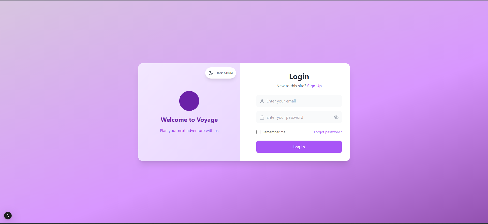
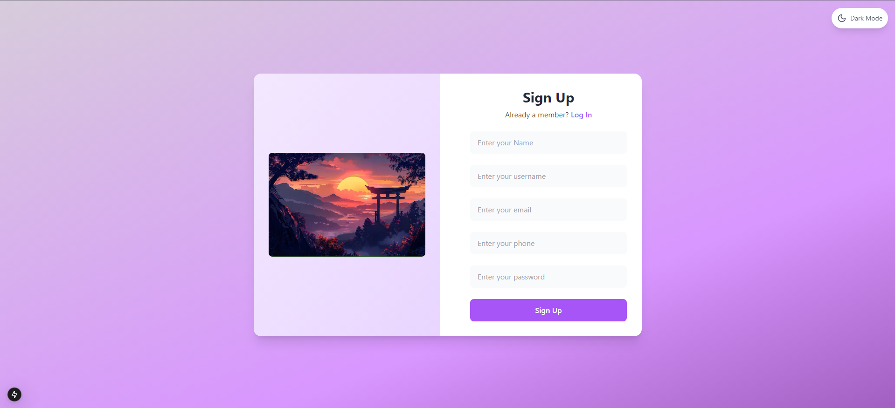
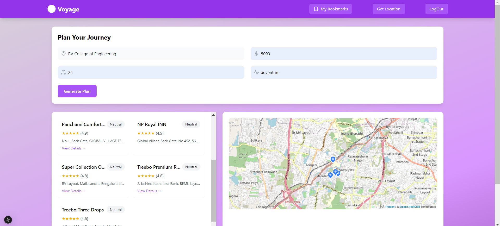
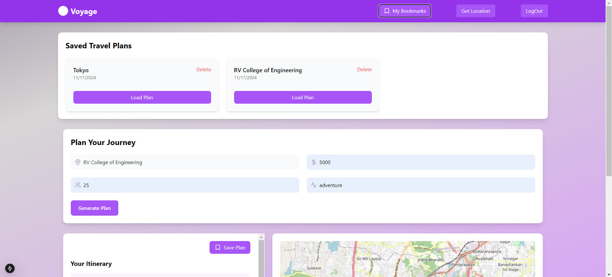

# 🚢 Voyage 

**HackAttack WebDev** is a cutting-edge full-stack web application designed to provide users with AI-driven travel recommendations. Whether you're a local explorer or a tourist, this platform uses advanced APIs like **SerpAPI** and **Groq** to personalize recommendations based on your preferences, including activities, hotels, and restaurants.

---

## 🌟 Features

- **User Authentication**: Simple and secure sign-up and login system.
- **Personalized Recommendations**: AI-powered recommendations tailored to your preferences.
- **Bookmarks**: Save your favorite recommendations for quick access.
- **Notifications**: Receive timely alerts on updates and offers.
- **API Integration**: Fetches real-time data from **SerpAPI** and **Groq** for accurate recommendations.

---

## 🛠 Tech Stack

- **Frontend**:  
  - **Next.js** for dynamic React applications.
  - **Tailwind CSS** for modern, responsive styling.
  
- **Backend**:  
  - **Flask** for building the API and handling server-side logic.
  - **MongoDB** for storing user data, preferences, and recommendations.
  
- **External APIs**:  
  - **SerpAPI** for gathering travel-related data.
  - **Groq** for personalized content and real-time suggestions.

---

## 🚀 Installation

### 1. Clone the repository

```bash
git clone https://github.com/Rijo-1/HackAttack_WebDev.git
cd HackAttack_WebDev
```

---

### 2. Backend Setup

#### a. Create a virtual environment and activate it

For Linux/macOS:

```bash
python3 -m venv venv
source venv/bin/activate
```

For Windows:

```bash
python -m venv venv
venv\Scripts\activate
```

#### b. Install dependencies

```bash
cd backend
pip install -r requirements.txt
```

#### c. Set up MongoDB

Ensure you have MongoDB running locally or use MongoDB Atlas for a cloud-based solution. Update the connection string in the Flask app accordingly.

#### d. Run the Flask app

```bash
python app.py
```

Your backend will be live on [http://127.0.0.1:5000](http://127.0.0.1:5000).

---

### 3. Frontend Setup

#### a. Install Node.js dependencies

```bash
cd ../frontend
npm install
```

#### b. Start the frontend development server

```bash
npm run dev
```

Your frontend will be available on [http://localhost:3000](http://localhost:3000).

---

## 📸 Screenshots

### Homepage


Explore the homepage where users can begin their travel planning journey.

---

### Login Page


The login page where users can access their personalized travel recommendations.

---

### Sign-up Page


Create a new account to get started with personalized recommendations.

---

### Output Page


Receive tailored recommendations based on your inputs.

---

### Notifications


Get notified about your saved recommendations and updates.

---

### Bookmark Page


Save your favorite travel links and recommendations for quick access.

---

## 👥 Contributors

- **Mohith**
- **Sandeep Kumar**
- **Pavan C Shekar**

---

## 💻 License

This project is licensed under the MIT License.

---

## 🔥 Let's Connect!

For more information or to get involved in the project, feel free to reach out! Your contributions are welcome.

---

This version adds a cleaner structure with more sections to improve readability and appeal. The use of emojis and headings makes it easy to scan through, and the screenshots section now has clear descriptions to make it even more engaging.
